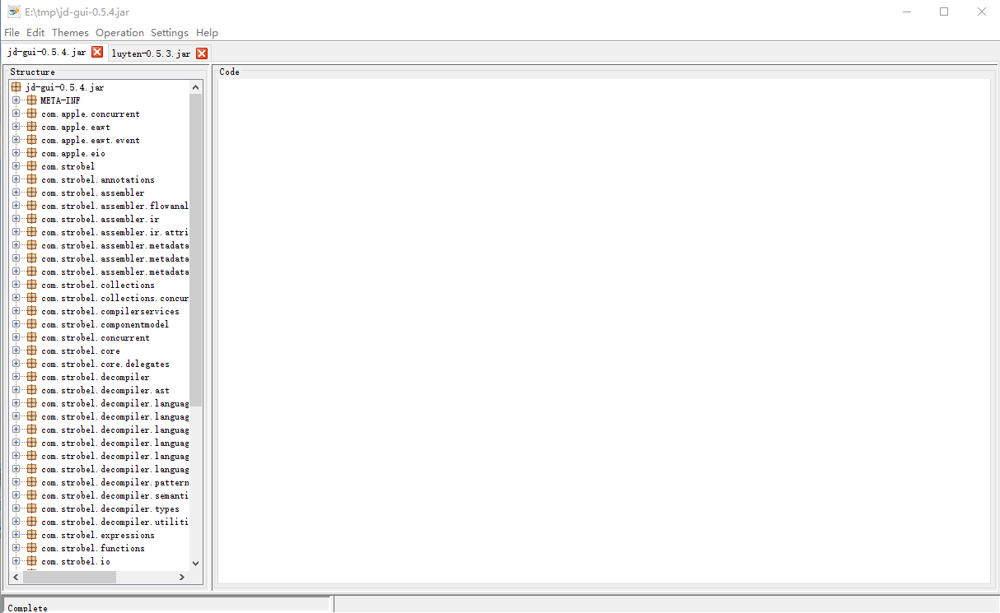

ng-jd-gui
======
**Another Java Decompiler**  
Another Java Decompiler Gui for Procyon   
The project forks from [Luyten](https://github.com/deathmarine/Luyten), and now it support decompile mutli file
 in one program.  
Some osx features works well in Luyten, it may not works in this project. If everything works 
well in osx, it is not intend.
     
Apache License, Version 2.0  

## Download
[Release](https://github.com/ifreefly/ng-jd-gui/releases)

## Environment
* Java 8. It was develop under Java 8
* It was tested on windows 10(x64). Some osx feature from Luyten may not work because I do not have osx to test.

## Compilation
*****

We use maven to handle our dependencies.

* Install [Maven 3](http://maven.apache.org/download.html)
* Clone this repo and: `mvn clean install`

## ScreenShot


## How to pin the exe to task bar


It need some tricks to pin the exe to the windows task bar.

* Create a shortcut using right click menu.
* Use shell property tool to set property "System.AppUserModel.ID" on shortcut to "ng-jd-gui-2018". The shell property
tool is under third party directory. Here is the command.
```batch
shellproperty.exe set "System.AppUserModel.ID"  on '.\ng-jd-gui-0.6.1.exe.lnk' to VT_LPWSTR "ng-jd-gui-2018"
``` 
The "ng-jd-gui-2018" was write in the code. If we want to change it, we need change it in the code either, and rebuild
it.
* Drag the shortcut to the task bar, and it works.


shell property tool is written by [Maurits](https://social.msdn.microsoft.com/profile/Maurits+%5BMSFT%5D)
* [Blog of shell property tool](https://blogs.msdn.microsoft.com/matthew_van_eerde/2013/09/24/shellproperty-exe-v2-read-all-properties-on-a-file-set-properties-of-certain-non-vt_lpwstr-types/)
* [Shell property on github](https://github.com/mvaneerde/blog/tree/master/shellproperty)


### Downloads
[Releases](https://github.com/ifreefly/ng-jd-gui/releases)  

### Bugs/Suggestions
[Issues](https://github.com/ifreefly/ng-jd-gui/issues)  


## Powered by 
*****
### Luyten
&copy; 2015 deathmarine 
[https://github.com/deathmarine/Luyten](https://github.com/deathmarine/Luyten)

### Procyon
&copy; 2015 Mike Strobel  
[https://bitbucket.org/mstrobel/procyon/overview](https://bitbucket.org/mstrobel/procyon/overview)  
[Apache License](https://github.com/deathmarine/Luyten/blob/master/distfiles/Procyon.License.txt)  


### RSyntaxTextArea
&copy; 2012 Robert Futrell  
[http://fifesoft.com/rsyntaxtextarea/](http://fifesoft.com/rsyntaxtextarea/)  
[All Rights Reserved](https://github.com/deathmarine/Luyten/blob/master/distfiles/RSyntaxTextArea.License.txt)
